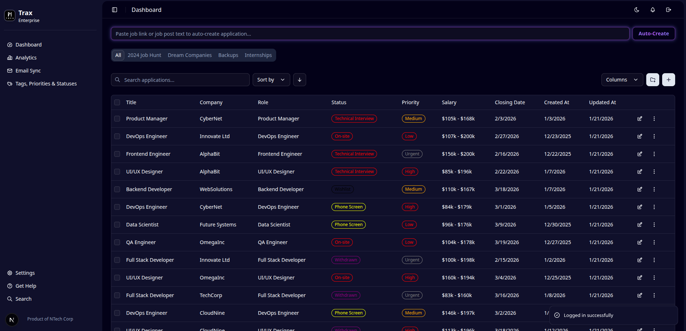
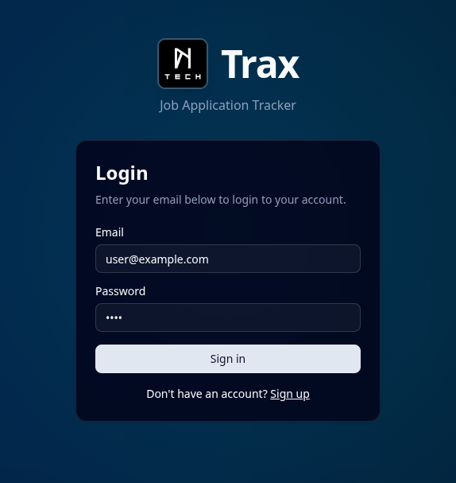
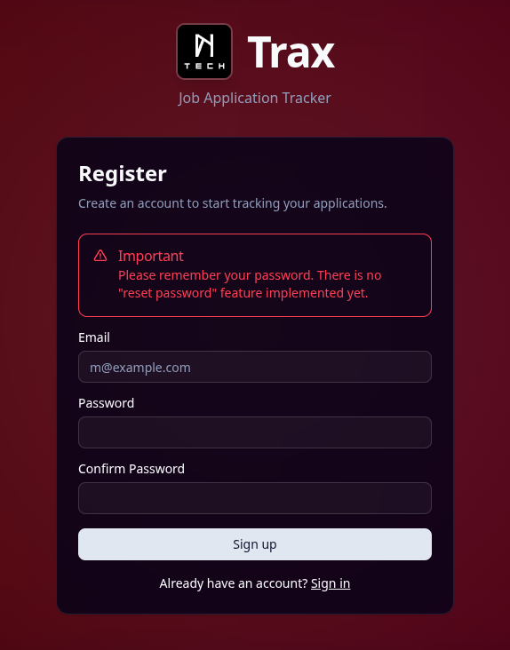

# Trax - Simple Job Application Tracker

Trax is a modern, full-stack web application designed to help job seekers organize and track their job applications. It features a robust backend built with FastAPI and a responsive frontend built with Next.js.

## Screens
Dashboard

Authentication
<p align="center" >
  
  
</p>

## Features

*   **Application Tracking**: Keep track of all your job applications in one place.
*   **Kanban-style Statuses**: Organize applications by status (e.g., Wishlist, Applied, Interviewing, Offer).
*   **Customizable Selects**: Create custom tags, priorities, and statuses to fit your workflow.
*   **Folder Organization**: Group applications into folders for better management.
*   **Dark Mode**: A sleek dark mode interface for comfortable viewing.
*   **Responsive Design**: Works seamlessly on desktop and mobile devices.

## Prerequisites

*   **Python 3.12+**
*   **Node.js 18+**
*   **PostgreSQL**
*   **Git**
*   **Docker** (Optional, for backend only)

## Project Structure

```
trax/
├── backend/        # FastAPI backend
│   ├── app/        # Application source code
│   ├── alembic/    # Database migrations
│   ├── .env-template # Template for environment variables
│   └── ...
├── frontend/       # Next.js frontend
│   ├── src/        # Source code
│   ├── public/     # Static assets
│   └── ...
└── README.md       # This file
```

## Backend Setup

1.  **Navigate to the backend directory:**
    ```bash
    cd backend
    ```

2.  **Configure Environment Variables:**
    Copy the template file to create your local environment configuration.
    ```bash
    cp .env-template .env
    ```
    Update `.env` with your local PostgreSQL credentials.

3.  **Run with Docker (Optional):**
    If you prefer to run the backend in a container:
    ```bash
    docker build -t trax-backend .
    docker run -p 5000:5000 --env-file .env trax-backend
    ```
    *Note: You'll need to ensure the container can access your database (e.g., by using `host.docker.internal` or running the database in a container on the same network).*

4.  **Manual Setup:**

    a.  **Create a virtual environment:**
        ```bash
        python -m venv .venv
        source .venv/bin/activate  # On Windows: .venv\Scripts\activate
        ```

    b.  **Install dependencies:**
        ```bash
        pip install -r requirements.txt
        # Or if using uv (recommended)
        uv pip install -r pyproject.toml
        ```

    c.  **Run Database Migrations:**
        ```bash
        alembic upgrade head
        ```

    d.  **Seed the Database (Optional):**
        ```bash
        python app/scripts/seed_db.py
        ```

    e.  **Start the Server:**
        ```bash
        python serve.py
        ```
        The backend API will be available at `http://localhost:5000`.

## Frontend Setup

1.  **Navigate to the frontend directory:**
    ```bash
    cd frontend
    ```

2.  **Install dependencies:**
    ```bash
    npm install
    # or
    yarn install
    ```

3.  **Configure Environment Variables:**
    Create a `.env.local` file:
    ```env
    NEXT_PUBLIC_API_URL=http://localhost:5000
    ```

4.  **Start the Development Server:**
    ```bash
    npm run dev
    # or
    yarn dev
    ```
    The frontend will be available at `http://localhost:3000`.

## Usage

1.  **Register** for a new account at [http://localhost:3000/register](http://localhost:3000/register).
2.  **Login** to access your dashboard.
3.  **Create Folders** to organize your job search.
4.  **Add Applications** with details like company, role, salary, and closing date.
5.  **Manage Selects**: Go to the "Tags, Priorities & Statuses" page to customize your workflow.

## Contributing

Contributions are welcome! Please feel free to submit a Pull Request.

## License

This project is licensed under the MIT License.
